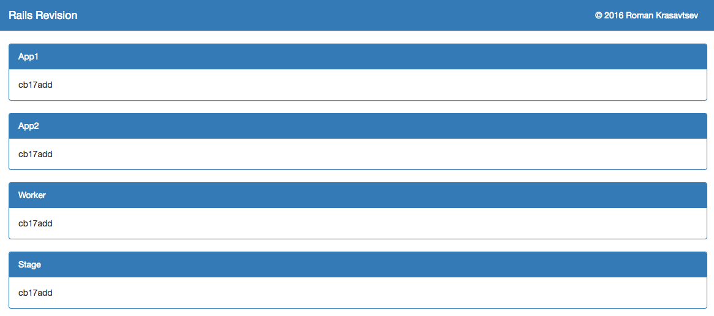

# Rails Revision

It’s always nice to know which version of your code is deployed. Each of our Rails apps include the REVISION file that capistrano creates during a deploy. If you don’t use capistrano, you can always shell out to git.

# How to use

Copy settings_sample.rb to settings.rb
```console
cp settings_sample.rb settings.rb
```
Edit and configure settings.rb for your application servers
```console
vim settings.rb
```
Then run
```console
$ ruby rails_revision.rb
```
And open in your browser [http://localhost:4567/](http://localhost:4567/)


